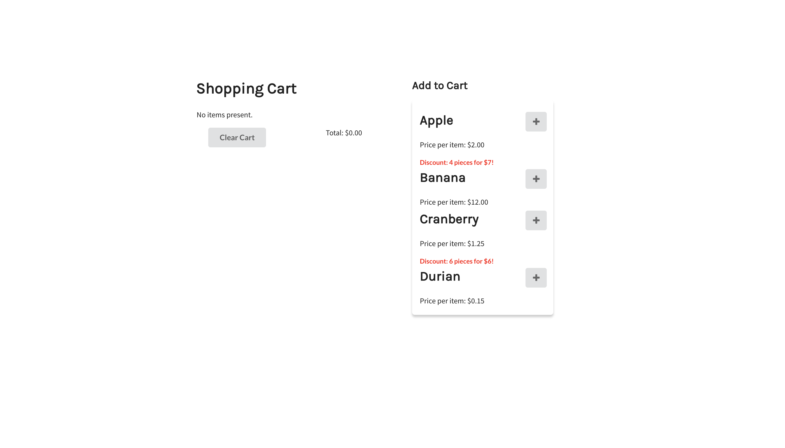

# Shopping Cart

A shopping cart with a select amount of items you can buy.

## Installation Guide

You'll be running both the client and the server on separate windows or terminals, however you wish. Enter both the `client` and `server` directories and run `npm install`.

First, run `node app.js` in your server terminal/window. Run `npm start` in your client terminal/window afterwards.

**WARNING**: The front-end will not generate the intended output at all unless the server back-end is ran first. This is what it should look like when ran correctly:

## Usage

There will be a box where you can add items to your shopping cart. You can do this by clicking the plus button. The shopping cart on the left will be updated immediately after.

**Persistence** is implemented in this application. Thus, the shopping cart will only be cleared when the "clear cart" button is clicked, granted that the server is still running.

This application is not intended to be responsive - it was developed with respect to a standard 12-inch MacBook Pro. However, this should not be too much of a problem if for instance, the application is being run on a larger resolution (i.e. desktop, ultrawide monitor). 